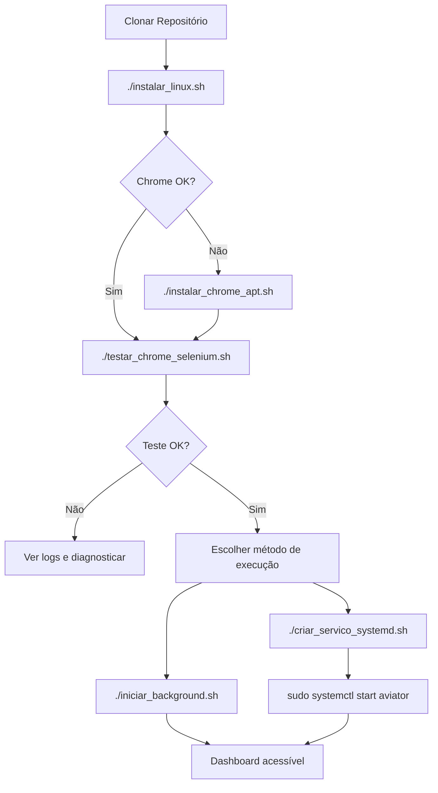

# ?? Guia Completo de Instalação - Aviator ML Intelligence

## ?? Documentação Disponível

- **[SOLUCAO_SNAP_APT.md](SOLUCAO_SNAP_APT.md)** - Resolver erro Chrome Snap vs APT
- **[EXECUTAR_BACKGROUND.md](EXECUTAR_BACKGROUND.md)** - Executar serviço em background
- **[WEBDRIVER_MANAGER.md](WEBDRIVER_MANAGER.md)** - Webdriver Manager (opcional)
- **[MELHORIAS_ML.md](MELHORIAS_ML.md)** - Melhorias nos modelos ML
- **[GUIA_RAPIDO.md](GUIA_RAPIDO.md)** - Guia rápido de uso

## ?? Instalação Rápida (3 Passos)

### 1. No Windows (Preparação)

```powershell
cd C:\Users\marco\source\repos\AviatorEstrela
git add .
git commit -m "update"
git push origin master
```

### 2. No Servidor Linux (Instalação)

```sh
# Conectar via SSH
ssh root@213.136.66.116

# Clonar/Atualizar
cd ~
git clone https://github.com/marcossan73/AviatorEstrela.git
# OU se já existe: cd ~/AviatorEstrela/AviatorEstrela && git pull

cd ~/AviatorEstrela/AviatorEstrela

# Dar permissões
chmod +x *.sh

# Instalar
./instalar_linux.sh

# Corrigir Chrome (se necessário)
./instalar_chrome_apt.sh

# Testar
./testar_chrome_selenium.sh
```

### 3. Iniciar Serviço

```sh
# Opção A: Primeiro plano (para teste)
./iniciar.sh

# Opção B: Background (pode desconectar SSH)
./iniciar_background.sh

# Opção C: Systemd (produção)
./criar_servico_systemd.sh
sudo systemctl start aviator
```

## ?? Scripts Disponíveis

| Script | Descrição |
|--------|-----------|
| `instalar_linux.sh` | Instalação completa (Python, Chrome, ChromeDriver, venv) |
| `instalar_chrome_apt.sh` | Remove Snap e instala Chrome via APT |
| `usar_webdriver_manager.sh` | Instala webdriver-manager (opcional) |
| `testar_chrome_selenium.sh` | Testa Chrome + Selenium |
| `diagnostico_chrome.sh` | Diagnóstico do Chrome |
| `detectar_chrome_real.sh` | Detecta caminho real do Chrome |
| **Execução** | |
| `iniciar.sh` | Inicia serviço (primeiro plano) |
| `iniciar_background.sh` | Inicia em background (nohup) |
| `iniciar_screen.sh` | Inicia em sessão screen |
| `iniciar_garantido.sh` | Inicia com verificações |
| `iniciar_com_xvfb.sh` | Inicia com display virtual |
| **Controle** | |
| `parar.sh` | Para serviço (nohup) |
| `parar_screen.sh` | Para sessão screen |
| `status.sh` | Mostra status do serviço |
| **ML** | |
| `diagnostico.sh` | Diagnóstico dos modelos ML |
| `diagnostico.sh --retrain` | Retreina todos os modelos |
| `diagnostico.sh --clean` | Limpa modelos antigos |
| **Systemd** | |
| `criar_servico_systemd.sh` | Cria serviço systemd |

## ?? Troubleshooting

### Erro: "no chrome binary"

```sh
./instalar_chrome_apt.sh
./testar_chrome_selenium.sh
```

### Erro: "session not created"

```sh
./usar_webdriver_manager.sh
./iniciar.sh
```

### Serviço não inicia

```sh
./diagnostico_chrome.sh
./testar_chrome_selenium.sh
./iniciar_garantido.sh
```

### Ver logs

```sh
# nohup
tail -f aviator_service.log

# screen
screen -r aviator

# systemd
sudo journalctl -u aviator -f
```

## ?? Fluxo Completo de Instalação



## ? Checklist de Instalação

- [ ] Python 3.10+ instalado
- [ ] Chrome instalado via APT (não Snap)
- [ ] ChromeDriver compatível
- [ ] Ambiente virtual criado
- [ ] Dependências Python instaladas
- [ ] Teste Selenium passou
- [ ] Serviço iniciado
- [ ] Dashboard acessível em `http://IP:5005`

## ?? Resultado Final

Após instalação bem-sucedida:

- ? Dashboard: `http://213.136.66.116:5005`
- ? Modelos ML treinados (>5, >10, >50, >100)
- ? Serviço rodando em background
- ? Logs em `aviator_service.log`
- ? Auto-start configurado (systemd)

## ?? Suporte

Consulte os arquivos de documentação para mais detalhes:
- Problemas com Chrome: `SOLUCAO_SNAP_APT.md`
- Executar em background: `EXECUTAR_BACKGROUND.md`
- Melhorias ML: `MELHORIAS_ML.md`

---

**Criado**: Dezembro 2024  
**Versão**: 2.0 - Enhanced ML + Chrome Fix
